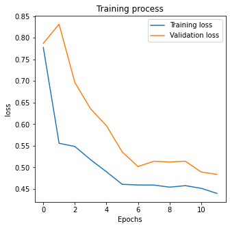
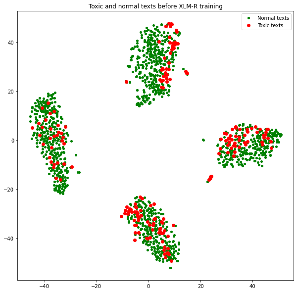
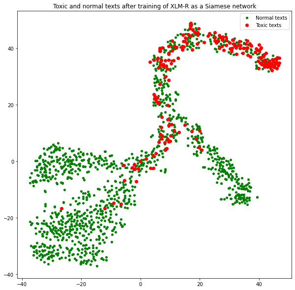

# Multi-Lingual Toxic Comment Classification

This repository contains experiments with a **cross-lingual text classifier** based on **metric learning** and **deep Transformer-based networks**. The goal is to build a semantic space that is independent of a specific language, enabling the classification of texts across multiple languages. The approach leverages the **Siamese Neural Network** with **XLM-RoBERTa** as a pre-trained model for feature transformation and the use of **Distance Based Logistic Loss (DBL Loss)** for more effective training.

## Key Features

* **Cross-lingual Classification**: The model can classify texts in languages with limited labeled datasets by leveraging transfer learning.
* **Transformer-based Networks**: Uses the XLM-RoBERTa model for feature transformation.
* **Metric Learning**: The Siamese neural network learns to map semantically similar texts closer in the feature space.
* **Distance Based Logistic Loss**: An improvement over the classical contrastive loss for quicker convergence and better performance in text classification tasks.

## Problem Statement

The task addresses two primary challenges:

1. **Language Independence**: Building a semantic space that is independent of the concrete language.
2. **Limited Data for Other Languages**: Large labeled datasets are available for one language, but training datasets for other languages are small or non-existent.

To overcome these challenges, the model leverages **transfer learning** to pre-train on a large corpus of one language and fine-tune the model using **Siamese networks** with a contrastive-based loss (DBL Loss) for better semantic space formation.

## Approach

### 1. **Pre-trained XLM-RoBERTa Model**

The experiment begins by using a pre-trained **XLM-RoBERTa** model, which is fine-tuned for cross-lingual transfer learning.

### 2. **Siamese Neural Network**

A Siamese neural network is used to learn the mapping from the original feature space into a semantic space. This network compares pairs of texts, where the goal is to minimize the distance between semantically similar texts and maximize the distance between dissimilar texts.

### 3. **Loss Function - Distance Based Logistic Loss (DBL Loss)**

The model uses **DBL Loss**, a contrastive-based loss function. This loss function encourages the network to learn a compact and well-separated semantic space, where semantically similar texts are closer together, and dissimilar texts are farther apart. **DBL Loss** helps in faster convergence compared to traditional losses like cross-entropy and triplet loss.

### 4. **Training**

The Siamese network is trained on large labeled text data for one language, with **DBL Loss** used to optimize the embedding space. The fine-tuning allows the model to perform classification tasks on texts from languages with smaller labeled datasets.

### 5. **Model Evaluation**

Performance is evaluated on the cross-lingual classification task, and results are shown for different languages.

## Installation

1. Clone the repository:

   ```bash
   git clone https://github.com/your-username/repository-name.git
   cd repository-name
   ```

2. Install dependencies:

   ```bash
   pip install -r requirements.txt
   ```

## Notebook Overview

This repository includes a Jupyter notebook (`siamese-main.ipynb`) with the following steps:

1. **Data Preprocessing**: Includes tokenization and text preprocessing.
2. **Model Architecture**: Defines the architecture of the Siamese neural network using XLM-RoBERTa.
3. **Loss Function**: Implements the **DBL Loss** function for contrastive training.
4. **Training Loop**: Code for training the Siamese network on large labeled text data.
5. **Evaluation**: Code for evaluating the model's performance on cross-lingual classification tasks.
6. **Plots**: Visualizations of the training process, loss curves, and evaluation metrics.

### Plots



## Usage

To run the notebook:

1. Open the notebook in Jupyter:

   ```bash
   jupyter notebook siamese-main.ipynb
   ```

2. Follow the steps outlined in the notebook to preprocess data, train the model, and visualize results.
